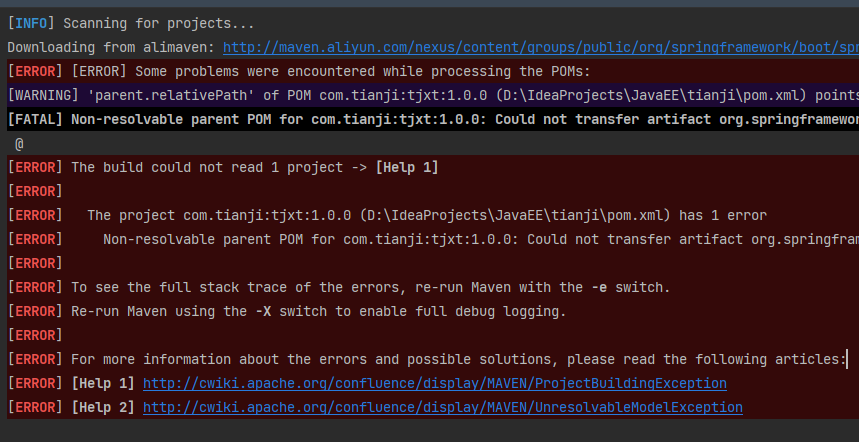

# 天机学堂项目bug解决

### 1. 启动项目时报错：

*Connection reset and 'parent.relativePath' points at wrong local POM @ line 32, column 13 -> [Help 2]*

#### 1. 解决办法：

[(67条消息) Maven install报错:Non-resolvable parent POM for..._你知道爬上树的感觉吗的博客-CSDN博客](https://blog.csdn.net/qq_40306266/article/details/115766704)

### 2. Maven的版本导致报错

### 3. 解决bug后idea不能push代码到gogs，报错如下：

*error: RPC failed; HTTP 401 curl 22 The requested URL returned error: 401*
*fatal: The remote end hung up unexpectedly*

#### 解决办法

